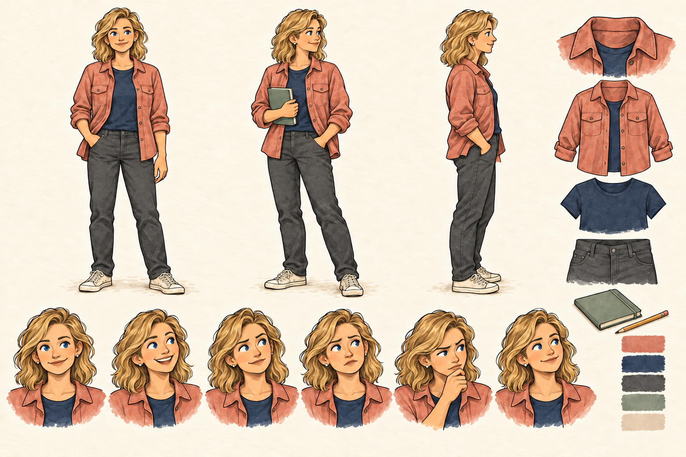

# git blame — character sheets for review

**All seven character designs are approved. Sophia v2 applies the requested blue eyes.** The seven-character ensemble and Sophia's name/security role are approved. Open this file in GitHub's rendered view to inspect each sheet. Each image is 1536 × 1024 and includes front, three-quarter and side views, six expressions, clothing/accessory details and color swatches.

## Alex

Dark curls, short beard, navy hoodie and cream incident mug. This revised sheet replaces the more realistic first pass.

## Maya

Dark bob, round glasses, green overshirt and slate notebook.

## Sam

Tousled auburn hair, mustard sweatshirt, jeans and off-white sneakers.

## Chris

Salt-and-pepper hair, rust cardigan, taupe chinos and green coffee mug.

## Nora — database engineer (approved design)

Low curly bun, plum knit vest, ivory blouse and ochre notebook.

## Eli — FinOps engineer (approved design)

Shaved head, short facial hair, slate-blue chore jacket and ochre tablet folio.

## Sophia — application security engineer

Golden-blonde waves, coral overshirt, navy top, charcoal jeans and sage notebook. Curious, practical and hands-on; joins a later story, not Chapter 1.

## Review checkpoint

All seven designs are approved; Sophia v1 is retained as superseded provenance. Use Sophia v2 with blue eyes for future scenes. Chapter 1’s opening-scene proof and storyboard checkpoints are cleared. The complete seven-scene chapter now awaits approval before Phase 6 site integration. Deployment has a separate explicit approval.
