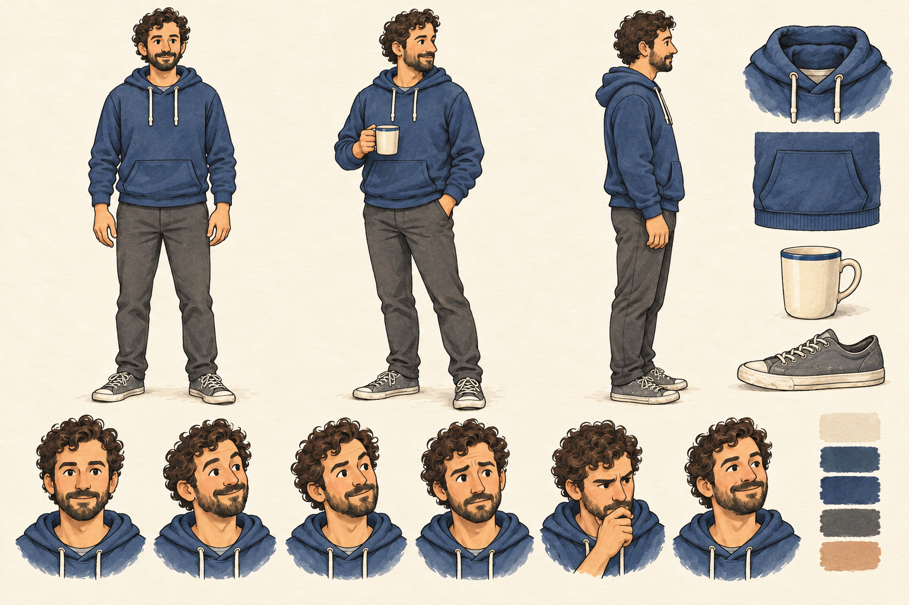
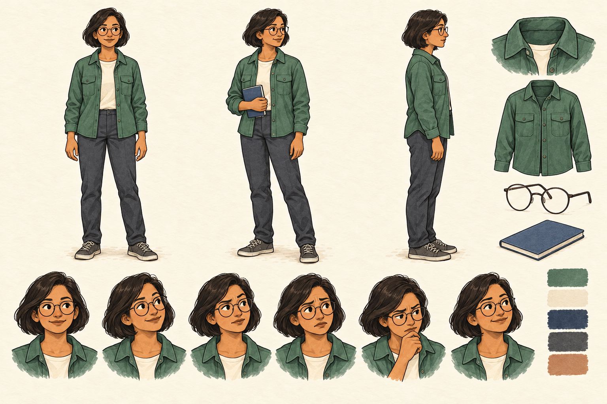
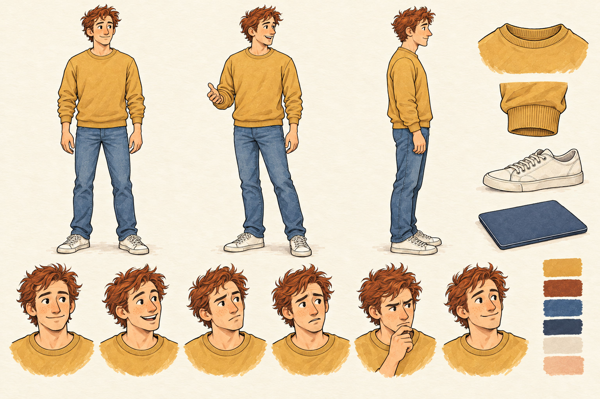
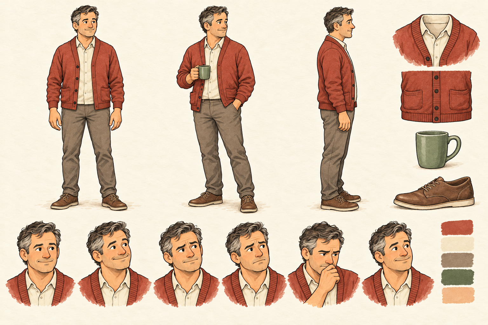
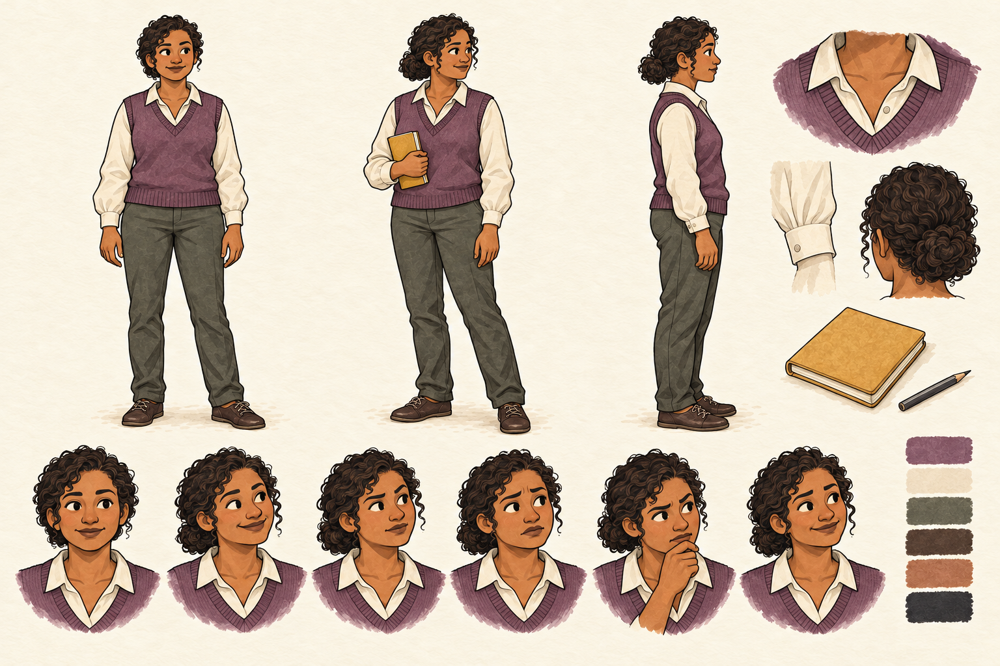
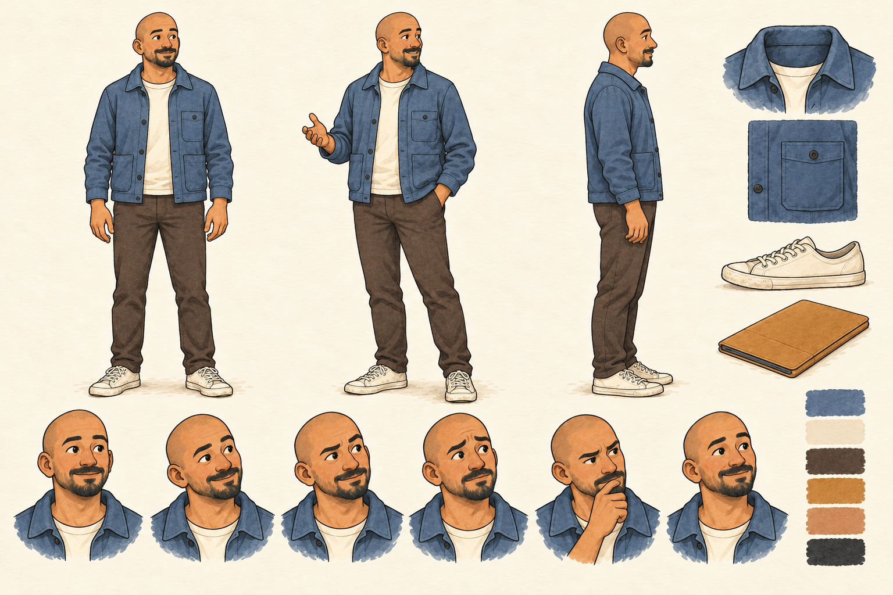

# git blame — character sheets for review

**Six designs are approved; Sophia's new sheet awaits visual approval.** The seven-character ensemble and Sophia's name/security role are approved. Open this file in GitHub's rendered view to inspect each sheet. Each image is 1536 × 1024 and includes front, three-quarter and side views, six expressions, clothing/accessory details and color swatches.

## Alex

Dark curls, short beard, navy hoodie and cream incident mug. This revised sheet replaces the more realistic first pass.

## Maya

Dark bob, round glasses, green overshirt and slate notebook.

## Sam

Tousled auburn hair, mustard sweatshirt, jeans and off-white sneakers.

## Chris

Salt-and-pepper hair, rust cardigan, taupe chinos and green coffee mug.

## Nora — database engineer (approved design)

Low curly bun, plum knit vest, ivory blouse and ochre notebook.

## Eli — FinOps engineer (approved design)

Shaved head, short facial hair, slate-blue chore jacket and ochre tablet folio.

## Sophia — application security engineer (new design for review)

Golden-blonde waves, coral overshirt, navy top, charcoal jeans and sage notebook. Curious, practical and hands-on; joins a later story, not Chapter 1.

## Review checkpoint

The original six designs remain approved. Sophia's new visual design needs approval before use in a generated scene. Chapter 1's storyboard is approved and the one-scene Phase 4 proof has its own checkpoint. The original four anchor everyday stories; the specialists recur when their expertise matters. Deployment has a separate explicit approval.

See the [supporting cast profiles](../../../../docs/comics/git-blame/supporting-cast.md), [design review](../../../../docs/comics/git-blame/character-design-review.md), [creative bible](../../../../docs/comics/git-blame/creative-bible.md), [reference observations](../../../../docs/comics/git-blame/reference-review.md) and [asset manifest](../../../../docs/comics/git-blame/character-assets.json). Exact generation prompts are saved with the documentation. `alex-v1.png` is retained only as a superseded record.

Review the [Chapter 1 storyboard](../../../../docs/comics/git-blame/chapter-01/storyboard.md).
