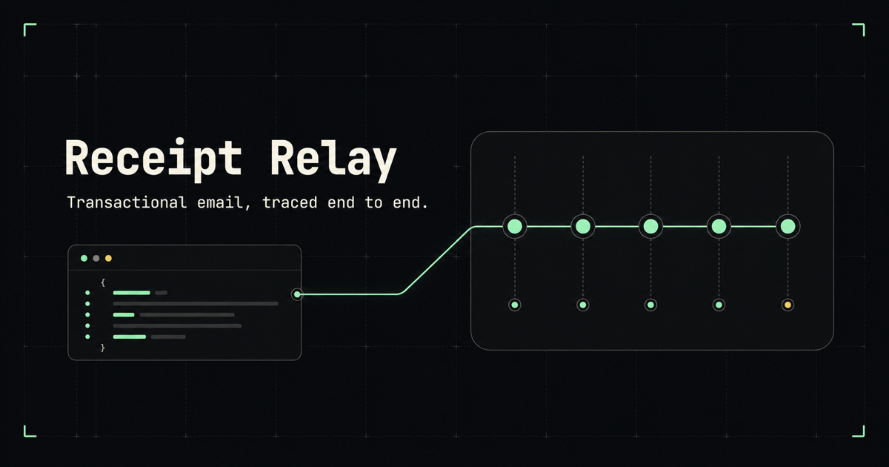
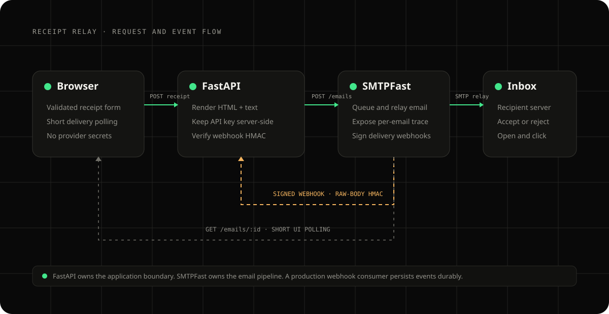
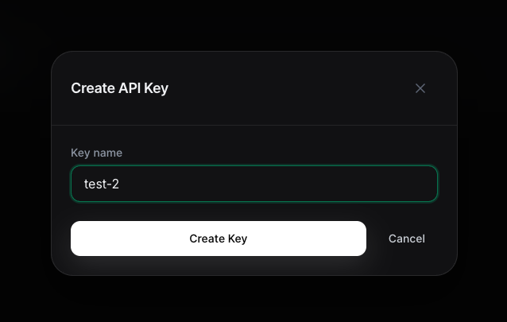

Your application gets a `200 OK` and an email ID. If you record that receipt as delivered, you have skipped the part where delivery actually happens. The provider still has to queue the message, hand it to a relay, negotiate with the receiving server, and report whether that server accepted or rejected it.

In this guide, you build **Receipt Relay**, a FastAPI application that sends a transactional receipt through [SMTPFast](https://smtpfa.st/) and makes that entire pipeline visible. You start with domain verification and a direct API smoke test, then add safe email rendering, delivery polling, signed webhooks, and tests that never send a real message.



## TL;DR

- SMTPFast's **Connect to Cloudflare** flow creates the DKIM, SPF, DMARC, and MAIL FROM records for you.
- You do not need a normal inbound MX record or an existing mailbox just to send transactional email.
- The SMTPFast dashboard currently asks only for an API-key name. Dashboard-created keys have broad access, so keep them server-side and separate them by environment.
- `POST /emails` returns a correlation ID, not proof of delivery. Use that ID to retrieve the delivery trace.
- Keep delivery status separate from engagement. A tracking-pixel request is an **open signal**, not proof that a human read the message.
- Verify webhook HMAC signatures over the raw body before parsing JSON, and deduplicate events before processing them.

## Prerequisites

- Python 3.11 or later
- Git
- An [SMTPFast account](https://smtpfa.st/register)
- A domain you control and access to its DNS configuration
- An inbox you control for the live test
- Basic familiarity with FastAPI and HTTP APIs
- Optional: Docker and Terraform for the deployment section

This walkthrough uses a Cloudflare-managed domain because SMTPFast provides a one-click setup for it. Other DNS providers work too; you add the same records manually.

## The 200 is only the first hop

Receipt Relay has one narrow job. A user enters a customer name, recipient, order reference, item, amount, and currency. FastAPI validates those fields, renders HTML and plain-text versions of a receipt, and calls SMTPFast. The browser receives the email ID and follows its delivery trace.



There are four boundaries in the flow:

1. **Browser to FastAPI.** Only receipt fields and an optional demo access code cross this boundary.
2. **FastAPI to SMTPFast.** The backend adds the API key and submits the email.
3. **SMTPFast to the recipient server.** The asynchronous delivery work happens here.
4. **SMTPFast back to FastAPI.** Signed webhook events report lifecycle changes without requiring an open browser.

The SMTPFast email ID connects all four boundaries. Treat it as a correlation key, not an inbox confirmation.

## Set up SMTPFast before writing code

Prove the provider works before introducing application code. That gives you a clean line between DNS or account problems and bugs in your FastAPI integration.

### 1. Add your sending domain

Sign in to SMTPFast, open the domain area, and add the domain you want to send from. You can use a root domain such as `example.com`, or a subdomain such as `mail.example.com` if you want transactional mail isolated from other systems.

The exact `from` address used later must belong to this domain:

```text
receipts@example.com
```

:::note
You do not need an existing mailbox or a normal inbound MX record just to send transactional email. The MX record SMTPFast creates on a bounce subdomain is for MAIL FROM and bounce processing; it does not create an inbox for `receipts@example.com`. If recipients should be able to reply, set `reply_to` to a real mailbox.
:::

### 2. Connect the domain to Cloudflare

When SMTPFast detects Cloudflare nameservers, the domain page displays **Connect to Cloudflare**:

1. Click **Connect to Cloudflare**.
2. Review the domain and proposed records in the Cloudflare tab.
3. Approve the change.
4. Return to SMTPFast.
5. Click **Verify Now**.

Cloudflare creates the records for you. SMTPFast's current setup includes:

- Three DKIM CNAME records for cryptographic signing
- An SPF TXT record authorizing the sending service
- A DMARC TXT record describing how receivers handle authentication failures
- An MX record on a bounce subdomain for MAIL FROM processing
- An SPF TXT record on that bounce subdomain

SMTPFast documents the current one-click flow and each record's purpose in its [Domains documentation](https://smtpfa.st/docs/domains).

If you do not use Cloudflare, copy the records shown by SMTPFast into your DNS provider exactly as displayed. Do not reuse values from another domain. DKIM hostnames are generated for your SMTPFast domain.

There are two common manual-setup mistakes. First, keep DKIM CNAMEs DNS-only rather than proxying them. Second, publish one SPF record per hostname:

```text
# Wrong: two SPF policies on example.com
example.com  TXT  "v=spf1 include:_spf.google.com ~all"
example.com  TXT  "v=spf1 include:amazonses.com ~all"

# Right: merge both senders into one policy
example.com  TXT  "v=spf1 include:_spf.google.com include:amazonses.com ~all"
```

### 3. Wait for verification

DNS changes are often visible quickly, but the underlying sending identity can take a few minutes to finish verifying. If the domain stays pending:

1. Confirm the records exist on the correct domain.
2. Check that all three DKIM CNAMEs are not proxied.
3. Confirm there is only one SPF record on each hostname.
4. Click **Verify Now** again.
5. Allow more time if SMTPFast says the records are visible but verification is still in progress.

Do not debug application code until the domain is verified. SMTPFast rejects an otherwise valid request when its `from` address uses an unverified domain.

### 4. Create the API key

Open the API Keys page and click **Create API Key**. The current dashboard asks for one value: a descriptive key name.



Use a name that identifies the application and environment, such as `receipt-relay-local`. Click **Create Key**, copy the generated value immediately, and store it in a password manager or secret store. SMTPFast only displays the complete key when it is created.

The dashboard does not currently show a scope selector. SMTPFast's [Authentication documentation](https://smtpfa.st/docs/authentication) says dashboard-created keys default to all scopes, while keys created through the API can request explicit scopes.

Because the dashboard key has broad access:

- Use a separate key for local, staging, and production.
- Keep it in server-side environment variables.
- Never place it in browser JavaScript, screenshots, Git commits, or container images.
- Revoke it when the environment no longer exists.

### 5. Run a direct API smoke test

Export the key in your current terminal session, then send to an inbox you control. Replace both email addresses before running the command.

```terminal
{
  "title": "SMTPFast smoke test",
  "prompt": "$",
  "steps": [
    { "cmd": "export SMTPFAST_API_KEY='replace-with-your-key'" },
    { "comment": "submit one HTML + text email from the verified domain" },
    { "cmd": "curl -s https://smtpfa.st/api/v1/emails \\\n  -H \"Authorization: Bearer $SMTPFAST_API_KEY\" \\\n  -H 'Content-Type: application/json' \\\n  -d '{\"from\":\"receipts@your-domain.com\",\"to\":[\"you@example.net\"],\"subject\":\"SMTPFast connection test\",\"html\":\"<p>The SMTPFast setup works.</p>\",\"text\":\"The SMTPFast setup works.\"}'", "output": "{\"id\":\"email_abc123\"}" },
    { "comment": "the ID is the lookup key for everything that happens next" },
    { "cmd": "curl -s https://smtpfa.st/api/v1/emails/email_abc123 \\\n  -H \"Authorization: Bearer $SMTPFAST_API_KEY\"", "output": "{\"id\":\"email_abc123\",\"status\":\"delivered\",\"last_event\":\"delivered\",\"events\":[...]}" }
  ]
}
```

The first response proves that SMTPFast accepted the request. The second shows what happened later. The full response includes status, timestamps, and an events array; see the [Emails API reference](https://smtpfa.st/docs/emails) for the current shape.

Fix provider setup errors here, before proceeding:

| Response | Typical cause                                      | What to check                               |
| -------- | -------------------------------------------------- | ------------------------------------------- |
| `401`    | Missing, invalid, or revoked key                   | Create a new key and update the environment |
| `403`    | Sender domain is not verified or sending is denied | Confirm the exact `from` domain is verified |
| `429`    | Account is being rate-limited                      | Respect the reset or retry headers          |

## Build Receipt Relay with FastAPI

With the direct request working, put a small application boundary around it. The browser never receives the SMTPFast key and never calls SMTPFast directly.

### 6. Install and configure the application

From the Receipt Relay project directory, create a virtual environment and install the project with its development tools:

```bash
python3 -m venv .venv
source .venv/bin/activate
python -m pip install -e ".[dev]"
```

Create `.env` from the included template:

```bash
cp .env.example .env
chmod 600 .env
```

Add the key and verified sender:

```dotenv
SMTPFAST_API_KEY=replace-with-your-smtpfast-api-key
SMTPFAST_FROM_EMAIL=receipts@your-verified-domain.com
SMTPFAST_BASE_URL=https://smtpfa.st/api/v1
SMTPFAST_TIMEOUT_SECONDS=20

# Added after creating the public webhook
SMTPFAST_WEBHOOK_SECRET=

# Optional shared code for a short-lived demo
APP_ACCESS_TOKEN=
```

Start FastAPI with the environment file:

```bash
uvicorn app.main:app --reload --port 8080 --env-file .env
```

Open `http://localhost:8080`. The page displays the configured sender but never returns either secret.

### 7. Validate before consuming quota

An email send is an external side effect. It consumes quota and can reach a real person, so reject malformed values before calling the provider.

```python
class ReceiptRequest(BaseModel):
    model_config = ConfigDict(extra="forbid", str_strip_whitespace=True)

    customer_name: str = Field(min_length=1, max_length=100)
    recipient: EmailStr
    order_id: str = Field(
        min_length=3,
        max_length=64,
        pattern=r"^[A-Za-z0-9][A-Za-z0-9._-]+$",
    )
    product_name: str = Field(min_length=2, max_length=120)
    amount_cents: int = Field(ge=50, le=100_000_000)
    currency: Literal["USD", "EUR", "GBP"] = "USD"
```

The model makes several deliberate decisions:

- `EmailStr` rejects malformed recipients.
- The order reference uses a small, header-friendly character set.
- Money crosses the API as integer cents rather than floating point.
- Currency is an enum rather than arbitrary text.
- `extra="forbid"` makes misspelled fields fail explicitly.

In a real checkout, accept an order ID and load the authoritative item and total from a database. Do not let a browser decide how much was paid.

### 8. Render safe HTML and a text alternative

Transactional messages need a useful plain-text body as well as HTML. Escape values before inserting them into the HTML context:

```python
customer = html.escape(receipt.customer_name)
product = html.escape(receipt.product_name)
order_id = html.escape(receipt.order_id)
total = _format_amount(receipt.amount_cents, receipt.currency)
```

Validation constrains shape and length; it does not make a string safe for HTML. A customer named `<script>alert(1)</script>` must appear as text, not markup.

Build the SMTPFast payload with both bodies and two correlation values:

```python
return {
    "from": self._settings.smtpfast_from_email,
    "to": [str(receipt.recipient)],
    "subject": f"Receipt for order {receipt.order_id}",
    "html": html_body,
    "text": text_body,
    "tags": [
        {"name": "category", "value": "receipt"},
        {"name": "order_id", "value": receipt.order_id},
    ],
    "headers": {"X-Entity-Ref-ID": receipt.order_id},
}
```

Tags help filter provider records. `X-Entity-Ref-ID` carries your application reference with the message. Neither replaces a database relationship, but both make one send easier to diagnose.

### 9. Call SMTPFast from the server

The client submits the payload to `/emails`, validates the returned ID, and records request latency:

```python
async def send_receipt(self, receipt: ReceiptRequest) -> ReceiptAccepted:
    self._require_send_configuration()
    started_at = time.perf_counter()
    response = await self._request(
        "POST",
        "/emails",
        json=self._build_receipt_payload(receipt),
    )
    latency_ms = round((time.perf_counter() - started_at) * 1_000)

    data = response.json()
    email_id = data["id"]
    return ReceiptAccepted(
        email_id=email_id,
        status=str(data.get("status") or "queued"),
        latency_ms=latency_ms,
    )
```

The shared helper adds authentication only on the backend:

```python
response = await client.request(
    method,
    f"{self._settings.smtpfast_base_url}{path}",
    headers={
        "Authorization": f"Bearer {self._settings.smtpfast_api_key}",
        "Content-Type": "application/json",
    },
    json=json,
)
```

The fallback `queued` status is intentionally conservative. The application has an ID and knows the request was accepted; it does not invent a later delivery event.

### 10. Keep a narrow browser-facing API

The browser submits to a FastAPI route rather than the provider:

```python
@application.post("/api/receipts", response_model=ReceiptAccepted)
async def send_receipt(
    receipt: ReceiptRequest,
    x_app_access_token: str | None = Header(default=None),
) -> ReceiptAccepted:
    _require_app_access(runtime_settings, x_app_access_token)
    return await application.state.smtpfast_client.send_receipt(receipt)
```

The complete handler maps configuration, authentication, rate-limit, and upstream failures into safe application errors. It never returns SMTPFast's raw error body, which may contain internal identifiers or request data.

Receipt Relay also exposes `/health` without calling SMTPFast. A load balancer should be able to check the process without sending an email or making the provider a dependency of every probe.

### 11. Retrieve and display the lifecycle

After a send, the browser receives the email ID and calls `GET /api/emails/{email_id}`. The backend retrieves and validates the SMTPFast record:

```python
async def get_email(self, email_id: str) -> EmailTrace:
    response = await self._request(
        "GET",
        f"/emails/{quote(email_id, safe='')}",
    )
    data = response.json()
    events = [
        EmailEvent.model_validate({**event, "source": "api"})
        for event in data.get("events", [])
    ]
    return EmailTrace.model_validate({**data, "events": events})
```

The browser polls briefly, renders values with `textContent`, stops after a bounded number of attempts, and leaves a manual refresh button. A typical sequence is:

```text
queued -> sending -> sent -> delivered
```

- **Queued** means SMTPFast accepted the work.
- **Sent** means the sending provider accepted the message for delivery.
- **Delivered** means the recipient mail server accepted it.
- **Bounced** or **failed** means delivery did not complete.

Even `delivered` does not guarantee primary-inbox placement. The receiving system can still route the message to spam.

### 12. Keep delivery separate from engagement

An open or click does not make a message "more delivered," and it should not replace the terminal delivery outcome.

SMTPFast records an open when its tracking pixel is requested. Image proxies, privacy features, and security scanners can request that pixel without a person reading the email. During the live Receipt Relay test, an open signal arrived about one second after delivery even though nobody had opened the inbox.

Receipt Relay therefore keeps **Delivered** as the status, shows the later event separately, and labels it **Open signal** rather than **Opened**.

:::warning
Do not use tracking-pixel events as proof that a person read a message. Treat them as noisy engagement signals. Automated security systems can also visit tracked links while inspecting email.
:::

## Receive and verify SMTPFast webhooks

Polling works for an interactive demo, but an application should not need an open browser to learn about a bounce. Webhooks reverse the flow: SMTPFast calls your application when an event occurs.

### 13. Expose a public HTTPS endpoint

Deploy Receipt Relay to your preferred platform or expose it through a trusted development tunnel. SMTPFast must be able to reach this endpoint:

```text
https://your-app.example/webhooks/smtpfast
```

`http://localhost:8080` exists only on your computer from SMTPFast's perspective.

### 14. Create the webhook

Create a standard-format webhook in SMTPFast with the public URL. Subscribe only to events your application uses:

```json
[
  "email.sent",
  "email.delivered",
  "email.delivery_delayed",
  "email.bounced",
  "email.failed",
  "email.suppressed",
  "email.opened",
  "email.clicked"
]
```

SMTPFast returns a signing secret when the webhook is created. It is not the API key. Store it separately as `SMTPFAST_WEBHOOK_SECRET`, then restart or redeploy the application. The webhook page's test action reports the response code and response time. The current event list and retry policy live in the [Webhooks documentation](https://smtpfa.st/docs/webhooks).

### 15. Verify the signature before parsing JSON

Standard webhook requests include `X-SMTPfast-Signature`, an HMAC-SHA256 digest of the raw request body using the webhook signing secret.

The word **raw** matters. Parse and reserialize JSON and you can change whitespace, ordering, or escaping, producing a different digest.

Read and bound the raw body first:

```python
body = await request.body()
if len(body) > MAX_WEBHOOK_BYTES:
    raise HTTPException(status_code=413, detail="Webhook payload is too large.")
if not _valid_webhook_signature(body, x_smtpfast_signature, secret):
    raise HTTPException(status_code=401, detail="Invalid webhook signature.")
```

Compare the expected and received values in constant time:

```python
def _valid_webhook_signature(
    body: bytes,
    signature: str | None,
    secret: str,
) -> bool:
    if not signature:
        return False
    expected = hmac.new(secret.encode(), body, hashlib.sha256).hexdigest()
    return secrets.compare_digest(signature, expected)
```

Only after signature verification do you parse and validate:

```python
payload = json.loads(body)
event = SMTPFastWebhookEvent.model_validate(payload)
await application.state.trace_store.add(event)
```

Signature verification proves that someone with the webhook secret produced the payload. Pydantic validation separately proves that the payload has the shape your application expects. You need both.

### 16. Make retries safe

SMTPFast retries when an endpoint fails or times out. Receiving the same event more than once is expected behavior.

Receipt Relay uses a bounded in-memory `OrderedDict` keyed by SMTPFast event ID. That deduplicates retries during one process lifetime and keeps the demo dependency-free. Production handling needs a durable sequence:

1. Verify the signature.
2. Validate the payload.
3. Insert the event with a unique constraint on event ID.
4. Commit the transaction.
5. Return a successful response.
6. Process slow downstream work asynchronously.

Do not acknowledge an event you have not recorded safely.

## Test the integration end to end

The automated suite should not consume quota, depend on DNS, or place messages in an inbox.

### 17. Mock SMTPFast in tests

HTTPX's `MockTransport` lets a test inspect the outgoing request and return a representative provider response:

```python
def handler(request: httpx.Request) -> httpx.Response:
    assert request.method == "POST"
    assert request.url == "https://smtpfa.st/api/v1/emails"
    assert request.headers["Authorization"] == "Bearer sf_live_test"

    payload = json.loads(request.content)
    assert payload["headers"]["X-Entity-Ref-ID"] == "ORD-2048"
    assert "Ana &lt;script&gt;alert(1)&lt;/script&gt;" in payload["html"]
    return httpx.Response(200, json={"id": "email_abc123"})
```

The escaped-name assertion tests the important HTML boundary, not just the happy path.

The webhook test signs the exact bytes it submits:

```python
body = json.dumps(event, separators=(",", ":")).encode()
signature = hmac.new(b"whsec_test", body, hashlib.sha256).hexdigest()

response = client.post(
    "/webhooks/smtpfast",
    content=body,
    headers={"X-SMTPfast-Signature": signature},
)
```

Add a negative test with a bad signature. One test proves correctly signed bytes pass; the other stops verification from accidentally becoming optional.

Run the checks:

```bash
ruff check .
ruff format --check .
pytest
```

No real SMTPFast key is required.

### 18. Send one real receipt

Return to `http://localhost:8080`, load the example, enter an inbox you control, and submit once.

Verify the complete path:

1. Receipt Relay displays an SMTPFast email ID.
2. The trace advances from queued through sending and sent.
3. The recipient server accepts the message or returns a failure.
4. The email contains readable HTML and a useful text alternative.
5. The sender uses the verified domain.
6. Later engagement appears separately from delivery.

Check spam. A technically successful first send from a new domain can still be filtered; authentication is a foundation for deliverability, not a guarantee of inbox placement.

| Symptom                | Likely cause                           | What to check                                               |
| ---------------------- | -------------------------------------- | ----------------------------------------------------------- |
| Authentication failure | Invalid or revoked key                 | Create a new key and update `.env`                          |
| Send denied            | Unverified or mismatched sender domain | Confirm the exact `from` domain is verified                 |
| Rate limited           | Too many requests for the account tier | Respect `Retry-After` instead of resubmitting               |
| Delivered but missing  | Recipient-side filtering               | Check spam, authentication results, content, and reputation |
| Immediate open signal  | Image proxy or scanner                 | Treat it as a pixel request, not a confirmed read           |
| Webhook `401`          | Secret or raw-body mismatch            | Check `SMTPFAST_WEBHOOK_SECRET` and the unmodified body     |

## Run the same app in Docker

The project includes a non-root Docker image and Terraform for DigitalOcean App Platform. Run the container locally with the same `.env` file:

```bash
docker build -t smtpfast-receipt-relay .
docker run --rm \
  --publish 8080:8080 \
  --env-file .env \
  smtpfast-receipt-relay
```

Use the non-sending health endpoint:

```bash
curl http://localhost:8080/health
```

Expected output:

```json
{ "status": "ok" }
```

The App Platform deployment is naturally two-stage:

1. Deploy with the SMTPFast API key and verified sender.
2. Read the public webhook URL from the deployment output.
3. Create the SMTPFast webhook using that HTTPS endpoint.
4. Add the returned signing secret.
5. Apply again and test the webhook.

Treat Terraform state as sensitive. Values marked sensitive are hidden from ordinary output, but state still stores resource arguments. Use an encrypted remote backend with restricted access for shared infrastructure.

## Production checklist

Receipt Relay is production-minded, not production-complete. Before adapting it to a real product:

- **Load trusted order data.** Accept an order ID and render values from your database rather than trusting browser-submitted totals.
- **Add idempotency.** A double-click, worker retry, or network timeout must not send a duplicate receipt.
- **Persist provider IDs.** Store the SMTPFast email ID with the business record that caused the send.
- **Persist webhook events.** Use durable storage and a unique event-ID constraint before acknowledging delivery.
- **Use real authentication.** Replace the shared demo code with user- and tenant-aware authorization.
- **Apply quotas.** Add per-user, per-tenant, and global send limits.
- **Protect recipient data.** Avoid logging full addresses and bodies by default; define retention and deletion behavior.
- **Enable tracking deliberately.** Open and click events affect privacy and remain imperfect signals.
- **Version templates.** Add localization, rendering checks, and snapshot tests.
- **Monitor the pipeline.** Track API failures, time to delivery, bounce categories, webhook retries, and consumer lag.

## What to take away

The most useful value returned by an email send is not "success." It is the ID that lets the rest of your application correlate what happens next.

Receipt Relay validates a real side effect before sending it, keeps SMTPFast credentials on the server, renders HTML and text bodies, follows each message's delivery trace, and verifies webhook events over the raw request body. The browser makes the lifecycle visible while the backend owns the provider and security boundaries.

The same pattern applies to password resets, invoices, deployment alerts, and account notifications: send once, keep the correlation ID, and design for everything that happens after the `200`.
