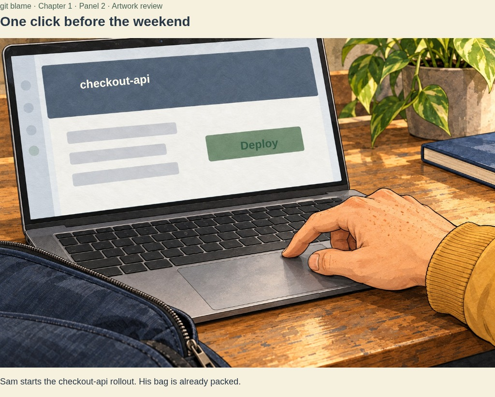
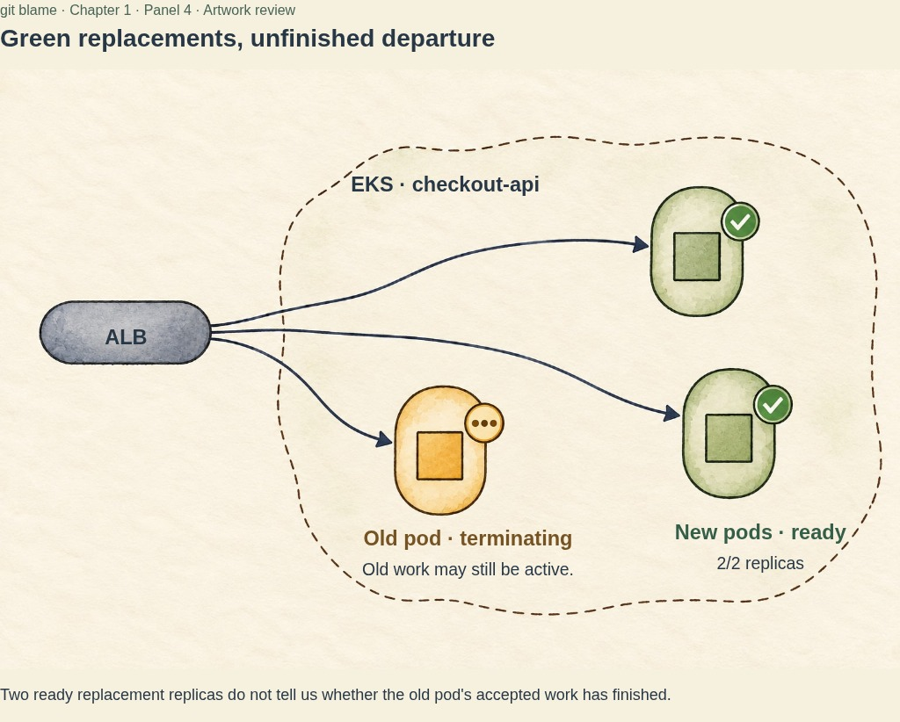
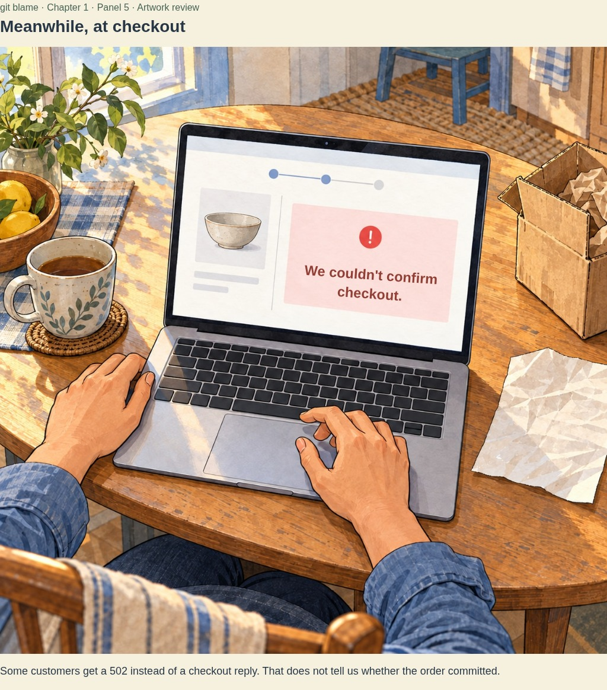
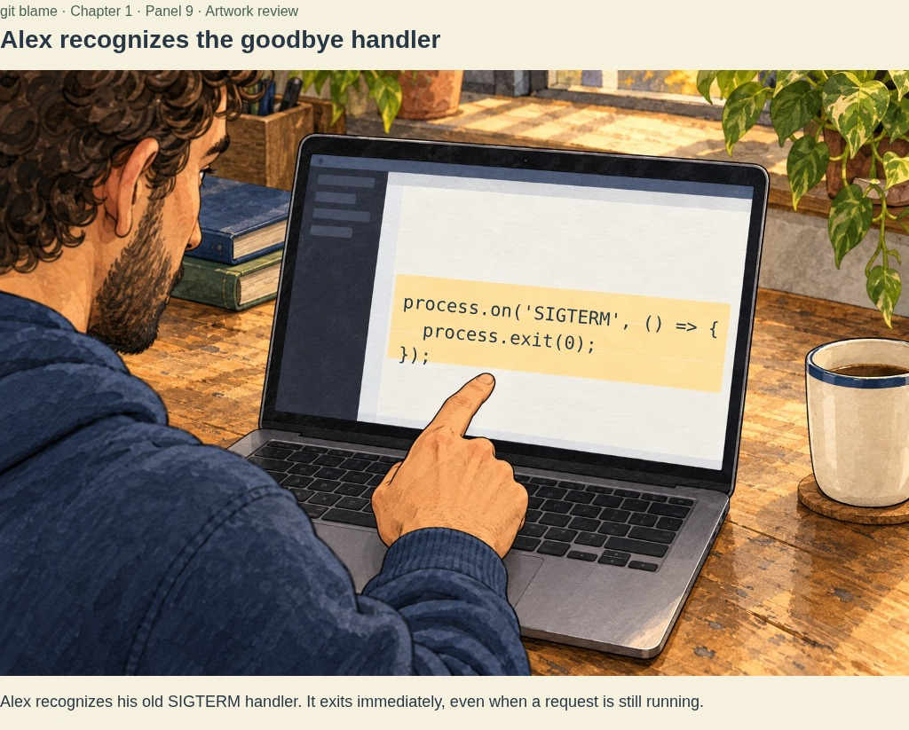
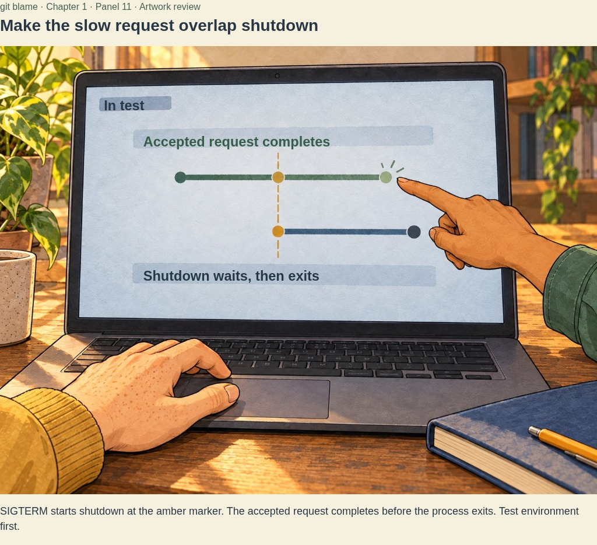
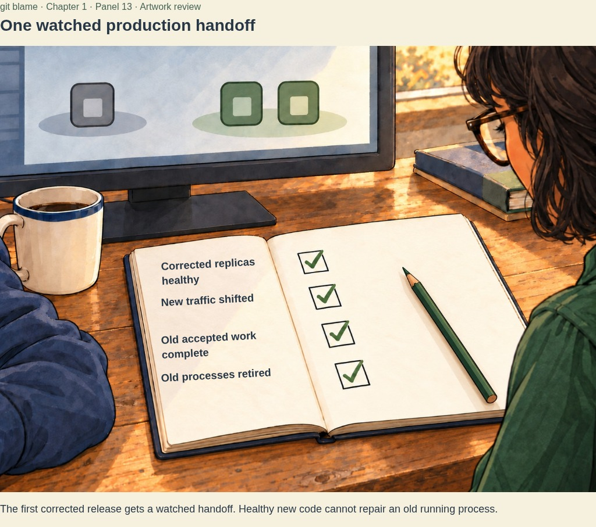

# The Pod That Wouldn't Die — fourteen-panel art sequence

10 October 2026 · Current illustration candidates in narrative order. Seven existing character moments, six new inserts and the earlier request-trace proof. Dialogue and technical lettering in these browser captures are editable in their source data; they are not baked into the illustration masters. The application and PDF remain their seven-illustration review editions until the revised art is integrated.

## 1. Friday, 4:57 PM

Sam's tiny change; Maya remembers last Friday.

## 2. One click before the weekend

The deployment is an action, with a packed bag beside it.

## 3. That's half a deployment

Sam is leaving; Alex notices what green leaves out.

## 4. Green replacements, unfinished departure

The replacement health and the retiring process are separate facts.

## 5. Meanwhile, at checkout

A customer's interrupted task gives the incident a consequence.

## 6. Checkout disagrees

Chris interrupts the departure; Maya pauses the rollout and follows one failure.

## 7. One failed request

Matched evidence leads to the old process exiting before its reply.

## 8. We hung up mid-sentence

The team explains what happened to that already accepted request.

## 9. Alex recognizes the goodbye handler

An exact code line makes the cause visible, and Alex owns it.

## 10. Humans own the fix

Codex helps trace, Claude Code can draft the test, and the engineers review and run it.

## 11. Make the slow request overlap shutdown

The test deliberately crosses the moment that broke the old process.

## 12. Excellent. Boring graphs.

The visible test earns a quiet moment of relief.

## 13. One watched production handoff

Corrected replicas cannot repair old running processes; the team completes the controlled first cutover.

## 14. Monday

Bags, closed laptops, and Chris's final tiny request.

[Six new images, phone layouts, provenance and technical caveats](README.md). ShipIt and the incident are fictional. No real shutdown test or production cutover is claimed here.
