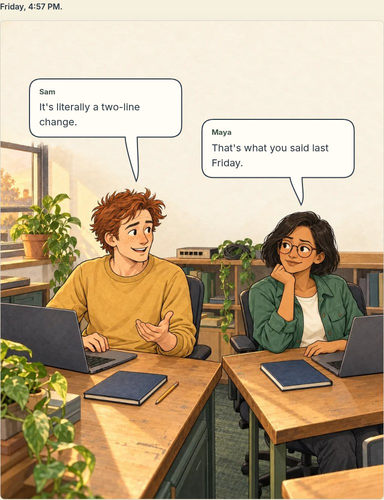
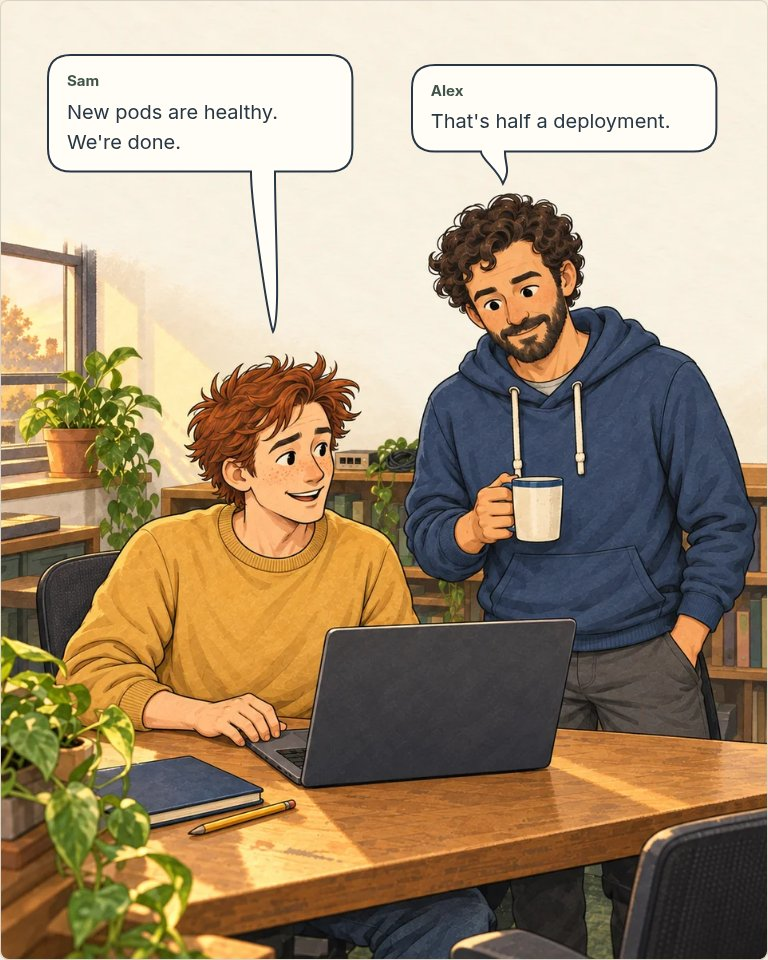
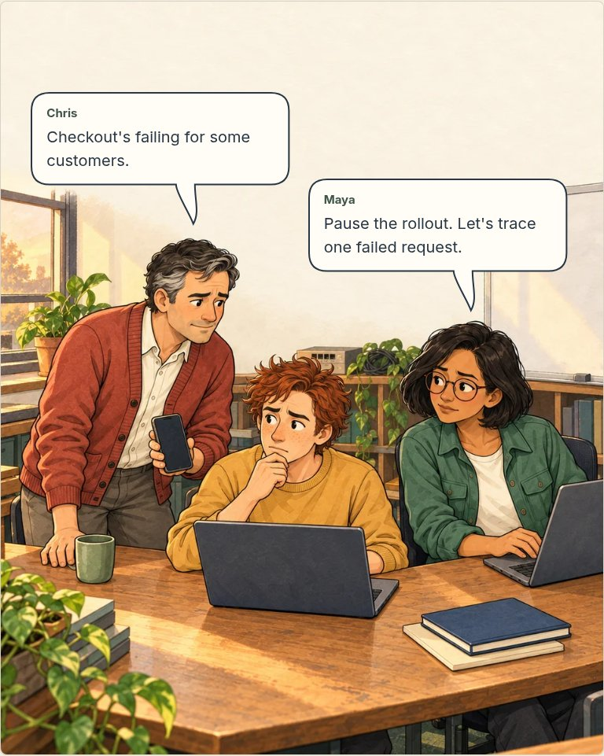
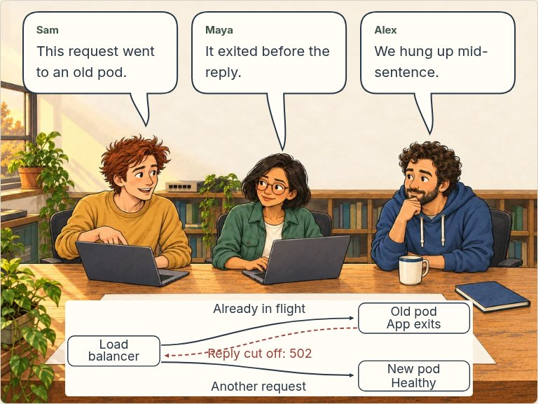
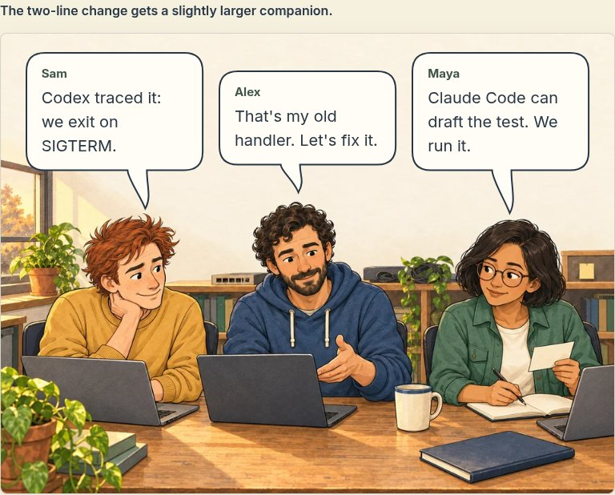
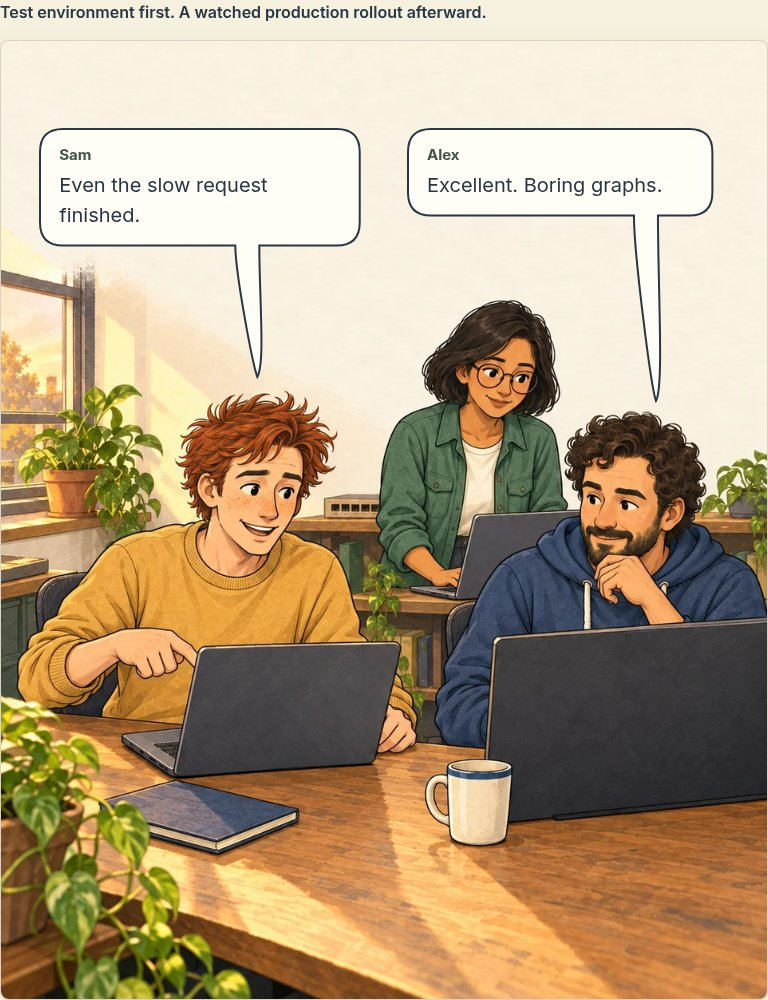
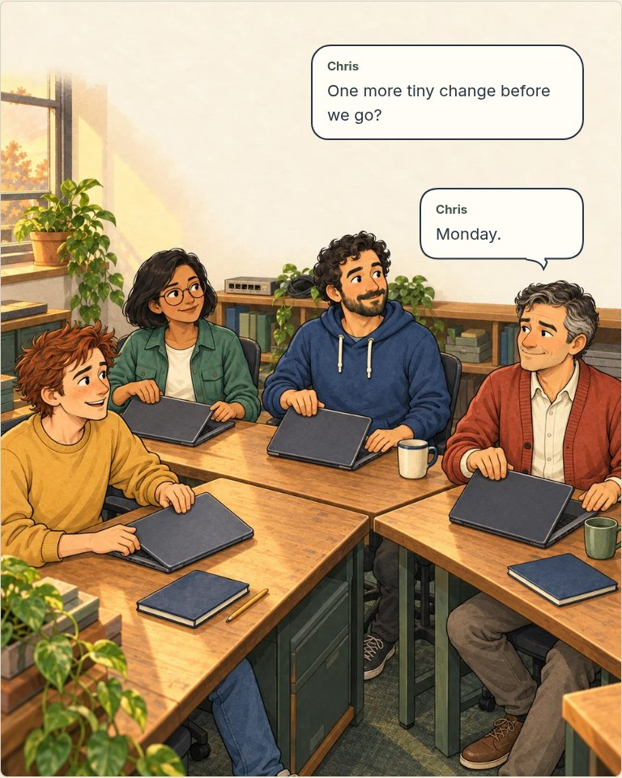

# The Pod That Wouldn’t Die — complete chapter review

Phase 5 · 9 October 2026 · **Ready for chapter approval before Phase 6 site integration.**

All seven narrative illustrations are generated. The original opening scene is approved; the remaining six and their final chapter pacing are presented here for approval. Sophia’s approved design now has the requested blue eyes in [her v2 sheet](../../../../../assets/comics/git-blame/characters/sophia-v2.png). She enters a later story, not this incident.

## Read the chapter

These captures show the exported reader with actual HTML dialogue and SVG bubble outlines. The rounded bubbles and curved tails form one continuous contour, replacing the detached chevrons identified in the proof. Tails point toward the speaker without covering faces. Below a 46em scene-container width, phones, smaller tablets and enlarged text keep the complete uncropped artwork followed by ordered dialogue, with no decorative arrows competing for space.

Scene-only captures exclude sticky site chrome and the floating back-to-top control, not story content. Those controls are still present in the application; final global reader polish belongs to Phase 6. Review both versions using the phone links under each scene.

### 1. Two lines

[Phone layout](scene-01-mobile-chromium.jpg)

### 2. Half a deployment

[Phone layout](scene-02-mobile-chromium.jpg)

### 3. Customers disagree

[Phone layout](scene-03-mobile-chromium.jpg)

### 4. We hung up mid-sentence

[Phone layout](scene-04-mobile-chromium.jpg)

### 5. The old handler

[Phone layout](scene-05-mobile-chromium.jpg)

### 6. Boring graphs

[Phone layout](scene-06-mobile-chromium.jpg)

### 7. Monday

[Phone layout](scene-07-mobile-chromium.jpg)

## Production files

- [Runtime chapter JSON](../../../../../content/comics/git-blame/chapter-01.json): dialogue, positions, tail targets, alt text, responsive assets and technical notes. No dialogue is baked into the generated masters.
- [Asset manifest](manifest.json): exact prompts, tool output filenames, references, dimensions, hashes and delivery settings. Source PNGs remain outside `public/`; the superseded Scene 4 composition is retained for provenance.
- [Approved storyboard](../storyboard.md), [source audit](../technical-notes.md) and [Under the Hood](../under-the-hood.md).
- Reproduce uncropped WebP/JPEG delivery files with `node scripts/comics/optimize-chapter.mjs`. All seven 480px WebP variants total 313,856 bytes; the 960px variants total 954,284 bytes. These are file-size totals, not a promised browser transfer or performance score; selection depends on viewport, pixel density and scrolling.

The unlinked, noindex review route is `/comics/git-blame/proof/chapter`. No public Comics section, navigation entry, final social card or public chapter URL has been added yet. The draft route is not access control.

## Engineering and story review

The failed request was already in flight on an old pod whose handler exited on SIGTERM. A separate request can succeed through a new pod; the interrupted request cannot move there. Scene 4 uses an authored, labelled diagram with a dashed failed-response path, plus semantic mobile text. Agents help inspect code and draft tests in Scene 5; engineers own review and execution. These are unsponsored editorial mentions. No chapter sponsor is confirmed; the future Neon migration rehearsal remains hypothetical.

Under the Hood explains the measured traffic-withdrawal allowance, application completion, shared `preStop`/termination grace budget and deadlines. The first corrected release keeps old processes alive during a controlled cutover; the new handler does not repair existing running pods. The story’s successful rollouts are fictional, not infrastructure tests performed here. Both canonical live AWS pages were inspected after the environment’s network changes took effect, resolving the earlier source limitation.

## Verification

- `pnpm build:fast` passed using pinned pnpm 10.34.5, Node 24.19.0 and four static-generation workers; 1,474 pages exported. Normal Google font loading passed without the earlier offline-response fixture. Exported browser requests load the generated WOFF2 font successfully.
- Twenty targeted Chromium checks passed against the export: complete content, healthy local tutorial links, desktop bubble placement against reviewed face regions, phone reading order, tablet overlay transitions, 320px with doubled text and expanded technical notes, dark theme, no JavaScript and the retained opening proof.
- Scoped comic TypeScript, ESLint and formatting checks passed. The earlier whole-repository type check recorded 518 existing diagnostics outside comic files; Next’s existing build configuration skips type checking. This is not a clean repository-wide type-check claim.
- Source and final rendered scenes were visually inspected for recognizability, clothing, hands, props, dialogue placement and technical direction. No automated screenshot check substitutes for the user’s editorial approval, a manual screen-reader audit or Safari coverage.

The existing site desktop navigation’s doubled-text overflow remains a Phase 6 acceptance item. Full Comics integration includes public routes, discovery, navigation, chapter contents/previous-next controls, canonical/search/sitemap decisions, OG cards and final reader UI. Approval of this chapter starts that separate phase. Production deployment requires explicit approval afterward.
