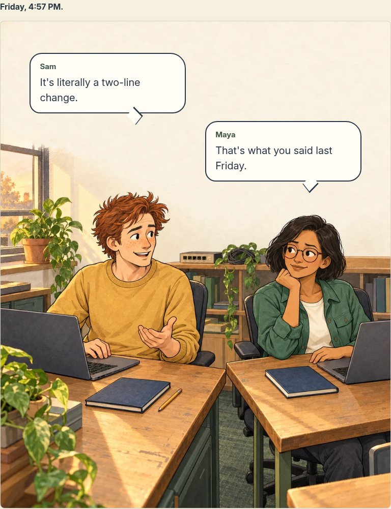
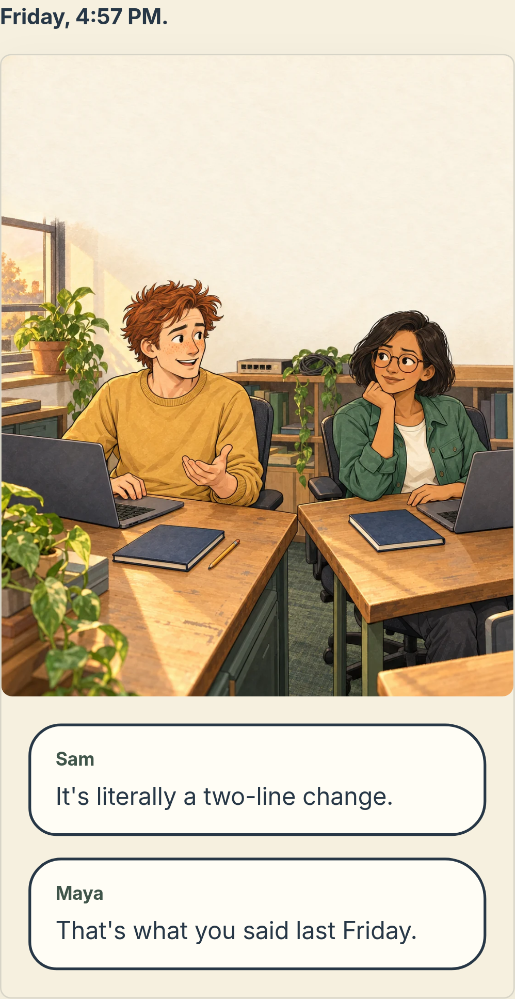

# Chapter 1 — Phase 4 opening-scene proof

9 October 2026 · **Awaiting approval before the remaining six scenes**

The user approved the Phase 3 storyboard, requested ordinary supervised Codex/Claude Code mentions (now in Scene 5), and approved adding Sophia to the seven-person ensemble. This checkpoint contains one complete Chapter 1 illustration and its responsive reader proof. Sophia's separate reference-sheet proposal also awaits visual approval; she does not enter Chapter 1.

## Review images

[Desktop at doubled text size](desktop-chromium-text-zoom.png) · [Phone at doubled text size](mobile-chromium-text-zoom.png) · [Text-free source art](../../../../../assets/comics/git-blame/chapter-01/scene-01-proof-v1.png) · [Sophia's proposed sheet](../../../../../assets/comics/git-blame/characters/sophia-v1.png)

Screenshots show the **exported production page**, not a painted mockup. They crop to the scene; sticky site chrome and developer overlays are excluded from the review capture, not hidden in the application. The site-level text-resize issue described below remains visible in the application.

## Artwork and reader

Actual tool output: `image_gen.imagegen`, 1122 × 1402 PNG (approximately 4:5). The exact [prompt](../prompts/scene-01-proof-v1.txt), approved Sam/Maya image references, original filename, dimensions, byte counts and hashes are preserved in [the proof manifest](manifest.json). The master stays outside `public/`; delivery files are resized/encoded without cropping or painting. Reproduce delivery variants with `node scripts/comics/optimize-opening-scene.mjs` from the repository root.

Visual review checked the faces, hairstyles, clothing, seated proportions, hands, laptop/desk perspective, window/shelf placement and absence of baked dialogue or technical lettering. Both characters retain their approved identities. The quiet wall gives the dialogue room without covering faces. The scene is not a standing height chart or a new approval for all later poses. Its office arrangement becomes a reference after approval; later wide shots still need continuity review.

Structured proof content lives in `content/comics/git-blame/proof.ts`. Reusable server-rendered `ComicScene` and `SpeechBubble` components keep dialogue in one ordered DOM list. At a container width of 40em or more, bubbles use normalized image coordinates and short directional tails. Below that width, or when enlarged text raises the font-relative threshold, the same dialogue flows beneath the complete image. Alt text describes visual action; speaker labels and dialogue remain selectable and accessible. No visual editor or new dependency is introduced.

The prototype route is `/comics/git-blame/proof`, unlinked, `noindex, nofollow`, and absent from the sitemap. It has one main landmark and a self-canonical URL. This is a draft review route, not a public launch or access-controlled private page. The complete Comics section, publication SEO/OG images, navigation and final reader polish are reserved for [Phase 6](../../production-roadmap.md).

## Verification and limits

- Frozen-lockfile install succeeded with repository-pinned pnpm 10.34.5. Node 24.19.0 satisfies the declared range; CI uses Node 22. Corepack activation also fixes nested `pnpm` scripts choosing the machine's incompatible global pnpm 11.
- Eight Playwright reader checks passed on both the development server and exported page using installed Chromium 151: valid route/metadata/artwork, dialogue order, desktop safe placement, mobile flow, doubled-text reader layout and JavaScript-disabled reading. Screenshots are from the final export. This does not constitute a manual screen-reader audit, Safari coverage or published performance measurement.
- Scoped comic TypeScript and ESLint checks passed. The whole repository type check reports 518 existing diagnostics outside the new comic files; CI already reports this backlog separately, and the repository's production build skips type validation. Do not call the full type check clean.
- `pnpm build:fast` succeeded with four static-generation workers and exported the proof alongside the existing site. Exported metadata, one main landmark, local assets and sitemap exclusion were inspected. Incidental generated tracked feeds/search index and Next's managed root agent block were restored.
- Google font fetches are denied by the current environment's network policy. Development/build/browser validation used Next's explicit `NEXT_FONT_GOOGLE_MOCKED_RESPONSES` fixture to load the repository's real Inter Regular/Bold fonts at `/fonts/`. Font loading was checked. This validates rendering/export with local font files; it does not validate production Google font downloads or every variable-font weight. Normal font-network validation remains outstanding until the saved domain additions are applied.
- The existing global desktop header overflows when root text doubles at 1280px. The comic itself switches to normal dialogue flow and stays within its container. This is recorded in Phase 6's acceptance criteria; page overflow must not be hidden as a workaround.
- Live AWS documentation remains blocked by the proxy. The technical audit distinguishes checked current Kubernetes/controller/Node sources from archived AWS material. Recheck the live ALB documentation before remaining technical artwork/final publication; Scene 1 contains no technical diagram or behavioral claim.

Review the drawing, character consistency, amount of dialogue space, desktop bubbles, phone fallback and Sophia's design. **Stop here for approval.** The remaining Chapter 1 artwork, complete chapter production and Phase 6 integration have not begun. Production deployment requires separate explicit approval.
