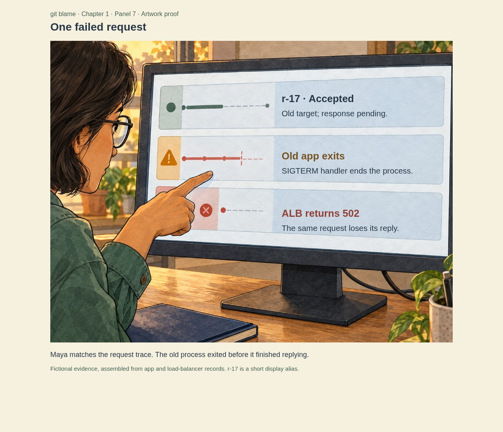
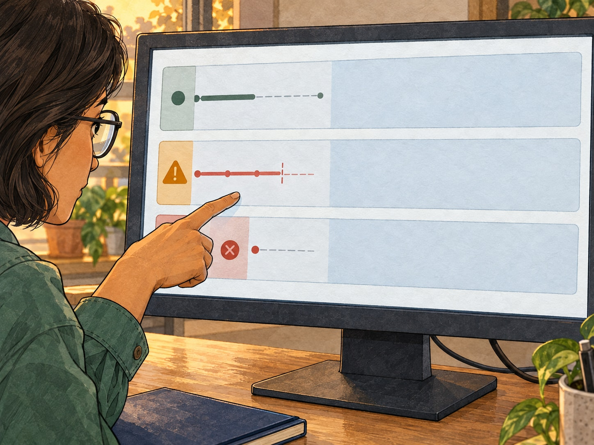

# Chapter 1 — first technical artwork proof

9 October 2026 · Panel 7 of the fourteen-panel revision · **Generated candidate.** The user subsequently authorized more images; see the [10 October six-image batch](../expanded-art-review/README.md) and [full reading sequence](../expanded-art-review/reading-sequence.md).

The user asked to focus on images and leave further site design to their other agent. This proof concentrates on the investigation: Maya's hand follows one failed request, with a tight camera, recognizable clothing/profile, textured physical materials and cooler screen colors. It replaces another broad office conversation with visible evidence.

## Lettered proof

[Phone reading view](panel-07-trace-phone.jpg) · [320px view](panel-07-trace-narrow-phone.jpg) · [Doubled text view](panel-07-trace-enlarged-text.jpg)

## Actual generated artwork

The image-generation model produced the monitor, evidence marks, Maya, hand and environment together. The lettering above is HTML rendered onto the review view, with no added diagram boxes or arrows. The [PNG master](../../../../../assets/comics/git-blame/chapter-01/panel-07-trace-v1.png) is 1448 × 1086, the model's actual output size; no upscaling or cropping is claimed. This JPEG is a delivery/review encoding of the same complete image.

The [exact submitted prompt](../prompts/panel-07-trace-v1.txt) and [generation manifest](manifest.json) preserve the reference paths, source filename, dimensions and checksums. References were the approved Maya sheet and opening illustration. No new identity or stock image was introduced. Reviewer checks covered the pointing hand, bob/glasses/green cuff, three evidence regions, label clearance and uncropped composition. The image remains a candidate for user review, not an approved final master.

## Meaning and lettering

Three chronological events carry this insert: the old target accepts the request; its defective SIGTERM handler exits before finishing the response; the ALB returns 502 for that request. `r-17` is a short fictional display alias, not an AWS trace ID format. This is a stitched investigation view, not a screenshot of native Kubernetes or AWS output. The labels do not imply that Kubernetes provides per-request signal logs or that a replacement pod takes over accepted work. The ALB trace field, application logging of `X-Amzn-Trace-Id`, old target address and process lifetime are the intended correlation evidence. A 502 does not establish whether an order committed.

[lettering.json](lettering.json) holds the editable labels, positions, image description and technical caveat for eventual reader integration. [review.html](review.html) is an isolated, static artwork review, with semantic ordered labels. It does not change the Next.js application. At wide sizes, lettering occupies the reserved illustrated screen areas. At phone widths and enlarged text sizes it follows the uncropped image in normal flow.

To regenerate the review HTML from its JSON, run `node docs/comics/git-blame/chapter-01/technical-proof/render-review.mjs` from the repository root. For captures, serve the checkout locally on port 3200, then run `node docs/comics/git-blame/chapter-01/technical-proof/capture-review.mjs`. `COMIC_ART_REVIEW_URL` and `COMIC_CHROMIUM_PATH` can override the review address and Chromium executable. These are local verification instructions, not a public deployment.

## Verification and next art

Four Chromium layouts passed: desktop, 393px phone, 320px phone and doubled root text. All loaded the actual illustration, retained 4:3 proportions, exposed exactly three complete ordered labels without horizontal overflow, and worked with JavaScript disabled. Desktop annotations did not overlap. [Recorded bounds](browser-checks.json) and the captures above come from this proof, not a mockup of the final chapter. Source, desktop, phone and enlarged-text output were visually inspected.

The subsequent inserts show the deployment's retiring/healthy replicas, the customer's interrupted checkout, the abrupt shutdown handler, an overlapping slow-request test and the controlled production handoff. They have now been generated following the user's request for more images and a PR update. The existing reader and downloadable PDF still contain seven illustrations; the fourteen-panel sequence is a repository art review. No final publication or infrastructure-test claim is implied by this proof.
