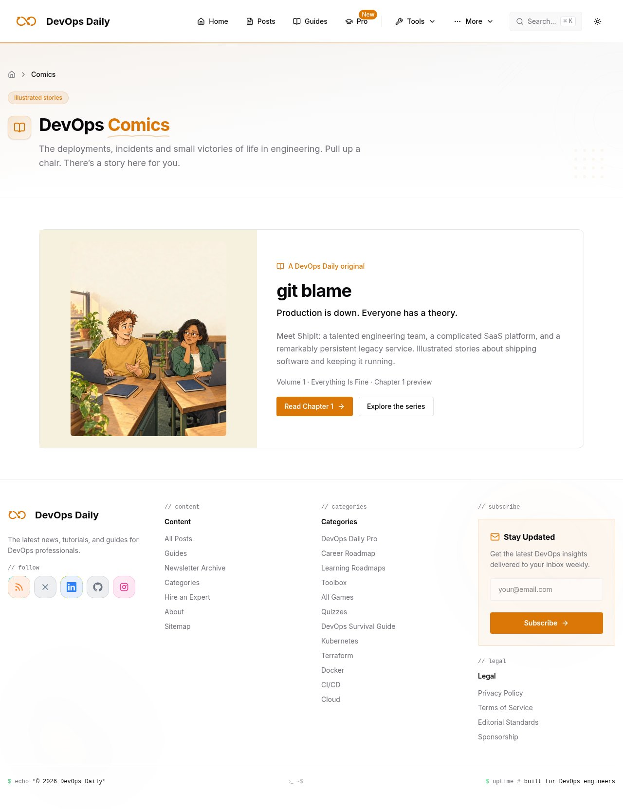
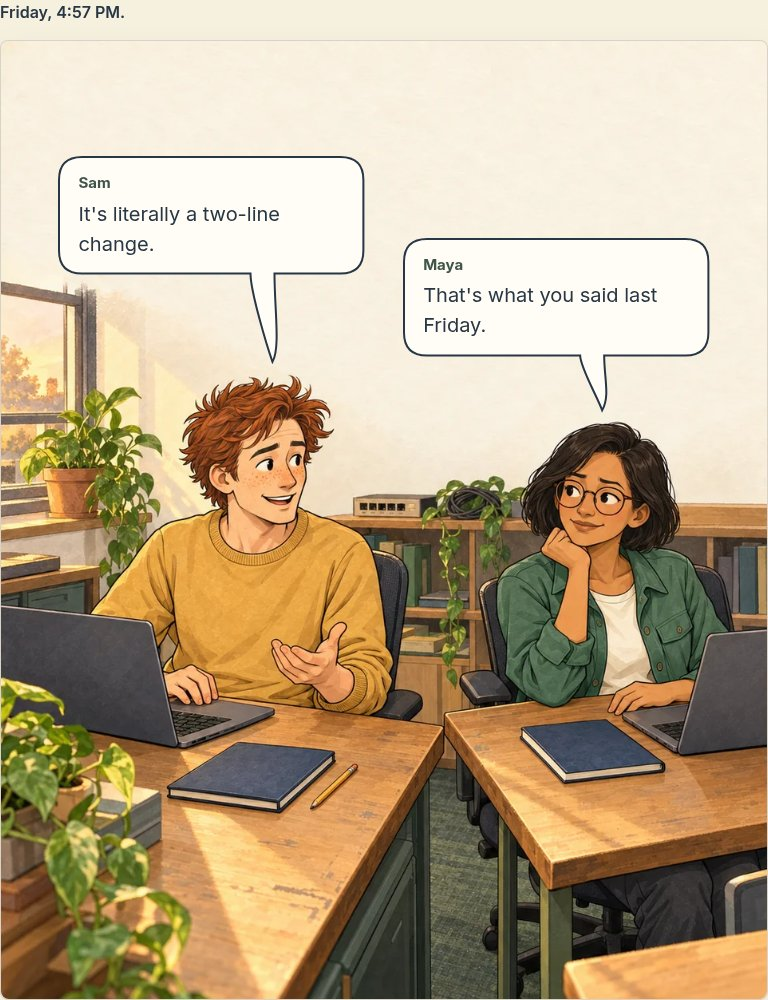
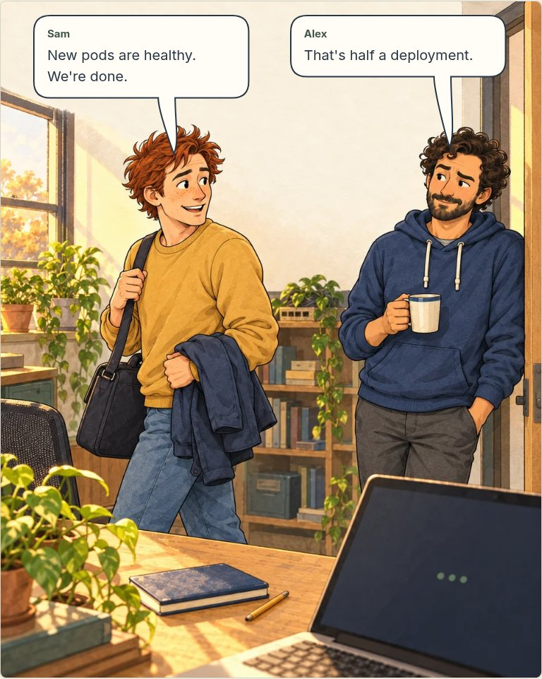
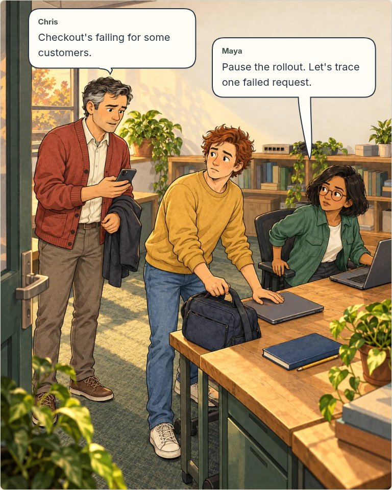
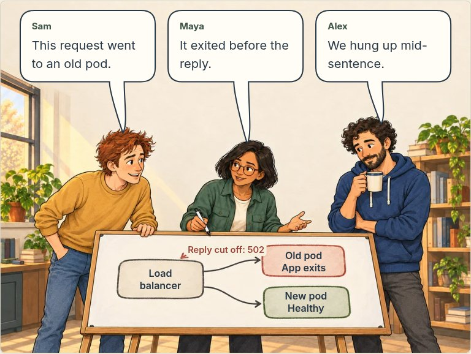
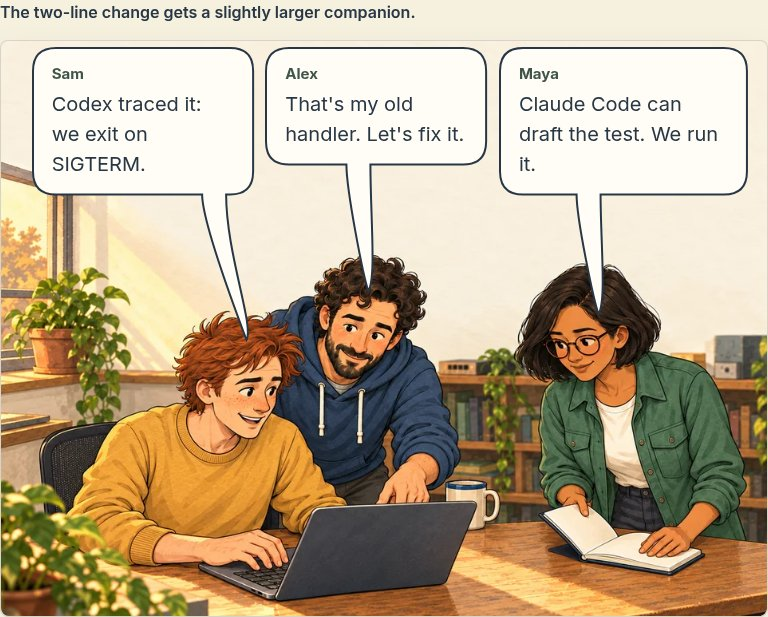
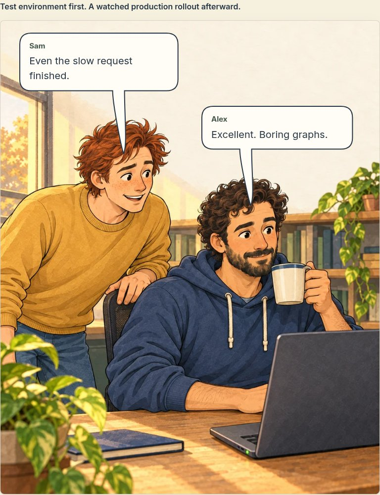
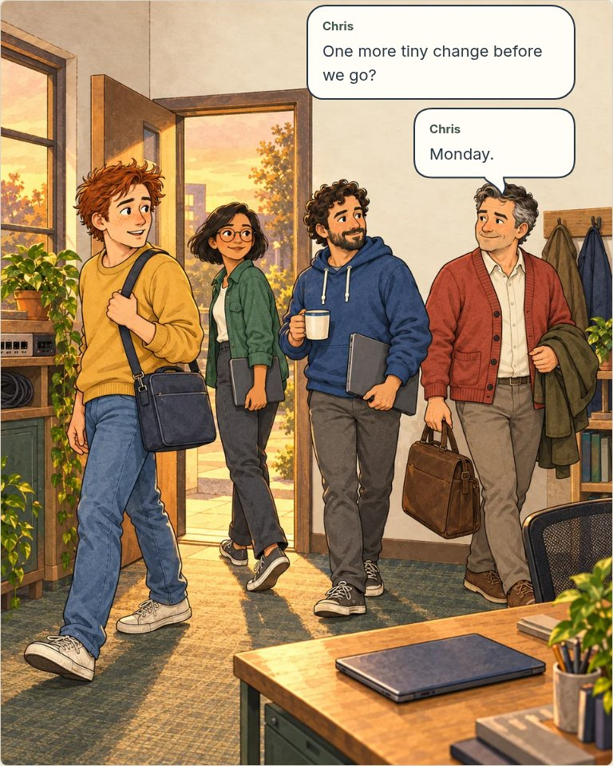
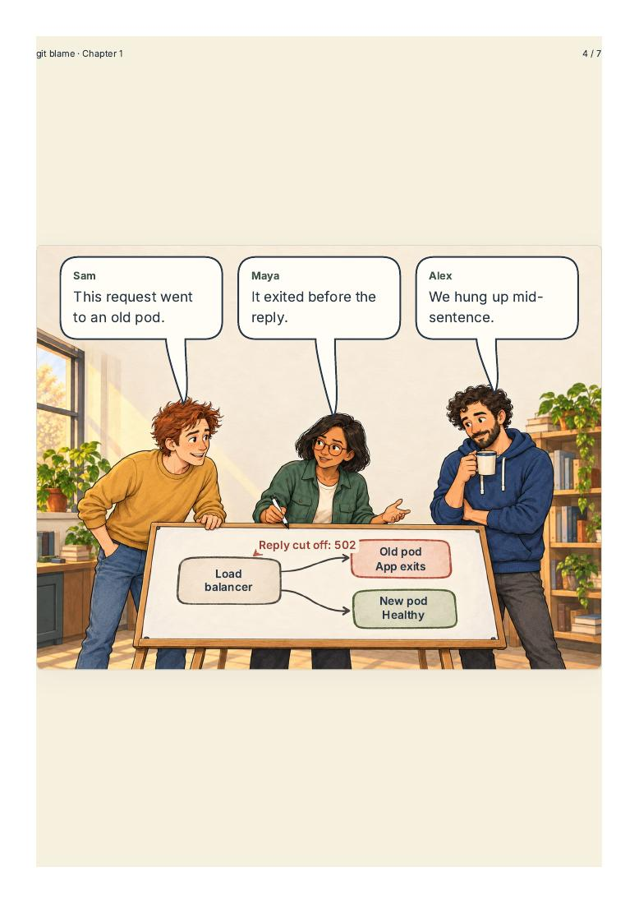

# git blame — revised chapter and site review

9 October 2026 · Phase 6 preview · Ready for artwork and site feedback. Nothing has been deployed or merged.

The approved opening remains; Scenes 2–7 use new reference-based artwork with departures, a doorway interruption, a standing whiteboard investigation, paired debugging and a quiet waiting beat. The model drew the whiteboard nodes and arrows as part of the scene. Dialogue and diagram labels are editable HTML. Earlier masters, exact prompts and superseded generation records remain in the [asset manifest](../chapter-01/production-review/manifest.json).

## Routes on this PR branch

| Route                             | Purpose                                                             |
| --------------------------------- | ------------------------------------------------------------------- |
| `/comics`                         | Comics library, with an entry for git blame                         |
| `/comics/git-blame`               | Series, volume contents, seven recurring characters and preview PDF |
| `/comics/git-blame/chapter-01`    | Complete seven-scene reader and optional Under the Hood             |
| `/comics/git-blame/proof/chapter` | Retained proof alias using the same reader                          |
| `/comics/git-blame/proof`         | Original opening proof                                              |
| `/comics/git-blame/print`         | Paginated, noindex source for PDF export                            |

These paths exist in the branch's running/static build; they are not claimed to be live on devops-daily.com. The reader's header scrolls away. Library/series navigation retains the normal site behavior. A font-relative navigation container switches to the mobile menu before enlarged labels overflow; a visible, named logo/home link remains available. Reading routes omit floating promotional extras.

The pages reuse the existing PageHero, breadcrumbs, buttons, brand tokens and navigation configuration. Comics appears in More → Explore Content and a compact homepage discovery card. Upcoming chapters are plain Coming soon cards, with no dead links. The reader has series contents, first/next chapter states, a real download and keyboard-accessible technical notes.

Canonical URLs, descriptions, OG/Twitter images and appropriate series/chapter structured data are in place. Three real static 1200 × 630 social cards use local artwork and authored lettering. Preview editions remain noindex and are excluded from sitemap, search and feeds until publication approval. No publication dates or sponsors are invented.

## Site views

[Phone library](library-mobile.jpg) · [Series desktop](series-desktop.jpg) · [Series phone](series-mobile.jpg) · [Reader entry desktop](reader-desktop.jpg) · [Reader entry phone](reader-mobile.jpg)

## Revised scene sequence

### 1. Two lines

[Phone reading layout](scene-01-mobile-chromium.jpg)

### 2. Half a deployment

[Phone reading layout](scene-02-mobile-chromium.jpg)

### 3. Checkout disagrees

[Phone reading layout](scene-03-mobile-chromium.jpg)

### 4. Mid-sentence

[Phone reading layout](scene-04-mobile-chromium.jpg)

### 5. The old goodbye

[Phone reading layout](scene-05-mobile-chromium.jpg)

### 6. Boring graphs

[Phone reading layout](scene-06-mobile-chromium.jpg)

### 7. Monday

[Phone reading layout](scene-07-mobile-chromium.jpg)

At smaller widths and doubled text, the full, uncropped artwork is followed by ordered dialogue and a semantic request trace. The diagram has three nodes, two separate outgoing request paths and one interrupted reply; no pod-to-pod transfer. Sources and rendered output were reviewed for faces, hands, clothing, props and dialogue clearance. Browser checks use manually reviewed face guards, not automated face recognition.

## Downloadable edition

[Download the preview PDF](../../../../public/comics/git-blame/downloads/chapter-01.pdf). Nine A4 pages: cover, seven scenes and Under the Hood/credits. Full illustrations retain their aspect ratios; landscape scenes are centered within portrait pages. Dialogue and diagram labels are selectable text, fonts are embedded, and the file is approximately 2.8 MB. Tagged output is enabled; this is not a PDF/UA certification.

`pnpm build:comics` exports the site and generates/verifies the PDF. `pnpm comics:check` rejects stale source/art/layout fingerprints. Ordinary builds validate and copy the committed file without requiring a browser. The explicit Comic PDF CI job provisions Chromium and uploads the download as a review artifact; it does not deploy. See [PDF details](../pdf-export-plan.md) and [actual input/output hashes](pdf-manifest.json).

## Verification

- Static export and combined PDF generation passed using pinned pnpm 10.34.5 and Node 24.19.0; 1,478 routes exported. Normal Google font loading succeeded.
- Thirty-four relevant Chromium browser checks passed against the export: seven complete scenes, original proof, diagram semantics, actual download, metadata/social dimensions, desktop/tablet face clearance, 320px and doubled root text, keyboard navigation, dark theme, no JavaScript and representative existing site pages.
- Scoped comic TypeScript, changed-code ESLint and scoped formatting checks passed. The repository already has unrelated TypeScript diagnostics, and its existing Next build skips type checking; this is not a whole-repository clean type-check claim.
- PDF page count, embedded fonts, all sixteen dialogue texts in raw-order extraction (joining wrapped compound words), actual page rendering, layout bounds and download signature were inspected. The source fingerprint also detected a stale export after a dialogue adjustment, and regeneration resolved it.
- Actual illustrations, reader captures, library/series views and the PDF whiteboard page were visually reviewed. Safari and a manual screen-reader audit remain outside this Chromium verification; final editorial approval belongs to the user.

ShipIt and the successful infrastructure tests shown in the story are fictional. Codex/Claude Code are unsponsored editorial mentions; engineers review and execute the work. The hypothetical Neon migration rehearsal remains a future chapter concept. Production deployment requires explicit approval after this review.
